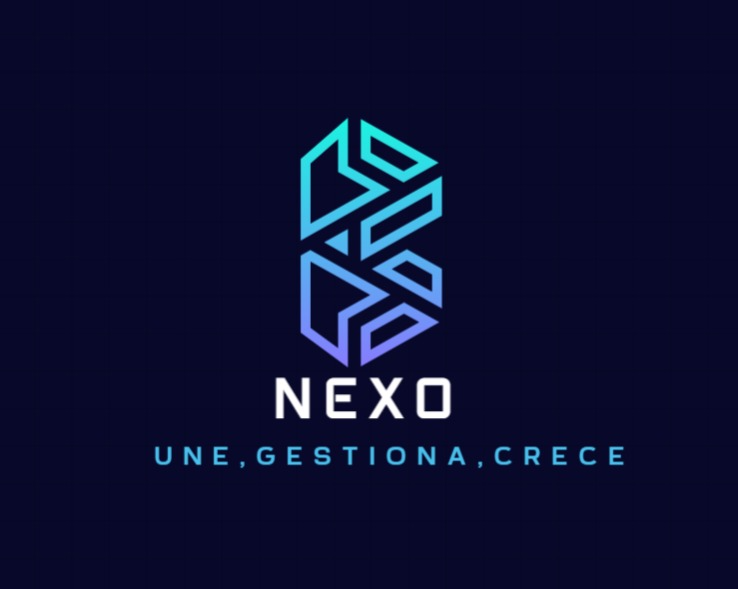

#  NEXO

## Objetivos del Desarrollo

- Desarrollar una aplicación móvil funcional y escalable que permita la autenticación de usuarios y captura de datos mediante GPS.  
- Integrar funcionalidades multimedia (como cámara y noticias) para enriquecer la experiencia del usuario.  
- Incorporar servicios en tiempo real, incluyendo notificaciones push y chats interactivos.  
- Optimizar la aplicación en rendimiento, seguridad y compatibilidad multiplataforma.  
- Garantizar una experiencia de usuario fluida mediante pruebas continuas de usabilidad y retroalimentación de usuarios piloto.  
- Publicar la aplicación en los stores correspondientes y documentar las lecciones aprendidas tras el despliegue.  

---

## Desarrollo

El proyecto se estructura en **fases y sprints ágiles** para facilitar el control del progreso y la calidad del desarrollo.  
Se inicia con la recopilación de requisitos y el diseño UI/UX, seguido de cuatro sprints centrados en la construcción progresiva de funcionalidades clave:  
- **Autenticación y GPS**  
- **Integración de cámara y noticias**  
- **Notificaciones y chats en tiempo real**  
- **Escalabilidad y refinamientos finales**  

Posteriormente, se ejecutan pruebas de usabilidad, optimización avanzada y el despliegue final con monitoreo inicial y documentación.  

---

## Documentación Detallada

La planificación completa del proyecto, incluyendo fases y actividades, está documentada en la Wiki del repositorio.

🔗 [Ver Cronograma](https://github.com/Omer21200/Pymes/wiki/Cronograma)
🔗 [Ver mockups](https://www.figma.com/design/KJNzBY5xyj6K5y3Bo81MOB/Pymes?node-id=0-1&t=riGIgywL9YMUHYqL-1)

---

## 🛠️ Tecnologías Previstas

- **Frontend:** Flutter  
- **Backend:** Firebase  
- **Control de versiones:** Git + GitHub  
- **Metodología:** Desarrollo Ágil (Scrum)

---

© 2025 - Proyecto de Aplicación Móvil | Equipo de Desarrollo
